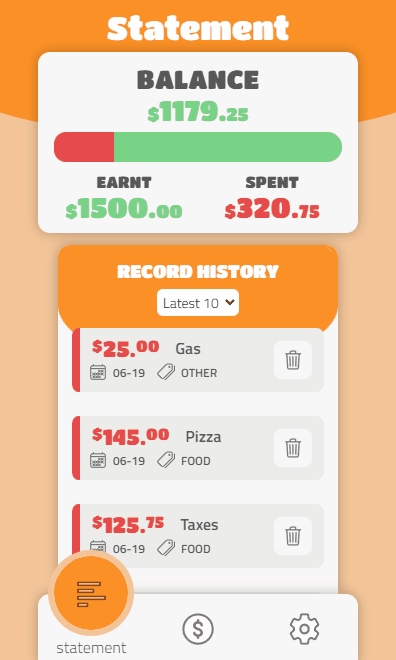
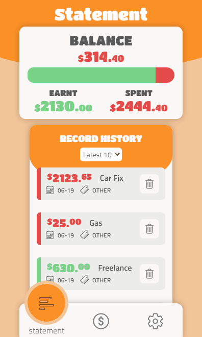
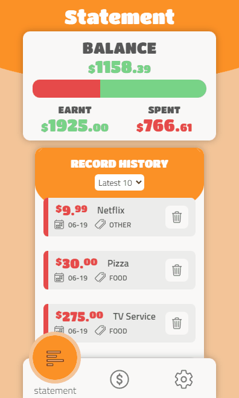

## BudgetBuddy
### Your friendly budget App for your empty pocket
$~$
## This is the repository of a work in progress PERN stack App
### The App is in a very MVP stage but it will be updated as I learn new stuff 💪
$~$
## **Table of Contents**
+ [Link to live demo](#link-to-live-demo)
+ [App screen captures](#app-screen-captures)
+ [Responsive features](#responsive-features)
+ [Notes for local deployment](#notes-for-local-deployment)
+ [Database schema](#database-schema)
+ [Nice to have features](#nice-to-have-features)

$~$

$~$

## **Link to live demo**
---
Follow [this link](https://budgetbuddyapp.netlify.app/) 🐇 to check a working App demo.

The Frontend Build is being hosted at Netlify while the Backend is hosted at Heroku (PostgreSQL DataBase included)

$~$

$~$

## App Screen captures
---
If you want to quickly check the UI and UX key features of this App, please take a look at the screen captures below.

#### **Loading components:**
As the Backend and DataBase are hosted at Heroku, it is possible that you have to wait until the Dynos wake up.

$~$

$~$

#### **Adding a new record:**
There are two types of records you can add > money you *earn* or money you *spend*.

$~$

$~$

#### **Updating a record:**
It is possible to edit a previous record but *the type* of record.

$~$

$~$

#### **Deleting a record:**

$~$

$~$

#### **Filtering the record list:**
Options you can choose to filter are > *Latest 10 records, All the records, Records by type*

$~$

$~$

## **Responsive features**
---
**Adding a New Record:**
On mobile phones with shorter screens the *erase/reset entered data button* gets hidden.

$~$

**Record Description:**
On mobile phones with narrower screens, *larger record descriptions* get truncated and displays 3 dots.

$~$

**Navigation Bar:**
On Tablets and Desktop the Navigation Bar change its possition for a better landscape configuration.

$~$

$~$

## **Notes for local deployment**
---
In case you want to use this repository locally, here are some caveats that hopefully will smooth the process 😅

**Proxy:**
Search in the *package.json* file for the Frontend code and change the proxy to localhost:5000 (or the port you are using for Node.js locally)

**DataBase:**
Search in the Backend code for the file *index.js* inside the *DB folder*. There you can uncomment/comment blocks of code for connecting locally to a database.
This project uses Postgres but you can quickly adapt it to use another relational database of your choice.

For a remote connection to a hosted database an URI approach is used. You can replace it with your own in the *config.env* file inside the *config* folder (or where you manage the enviroment variables)

$~$

$~$

## Database Schema
---
Checkout the file *database.sql* inside the *db folder* on the Backend code to have an idea and get SQL commands that may help you re-create the database locally.

If you are a visual learner, the graph below could be of better help:

Follow [this link](https://dbdiagram.io/d/62647d961072ae0b6ad84136) 🐇 to get to interact with the diagram.

$~$

$~$

## **Nice to have features**
---
There is so much to learn and implement that I decided to keep a checklist -althought looking at it is overwhelming 😬

- [X] Write a readme to the repo :)
- [ ] A more semantic HTML
- [ ] Subtle animations and cool microinteractions
- [ ] More types of graphs to better analize the data
- [ ] ORM Model DB, types and validation (could it be Sequelize?)
- [ ] Multiple users, Login Auth (JWT?)
- [ ] Add and manage new categories
- [ ] More records filtering options (date, categories)
- [ ] PWA - serviceworker
- [ ] Unit testing